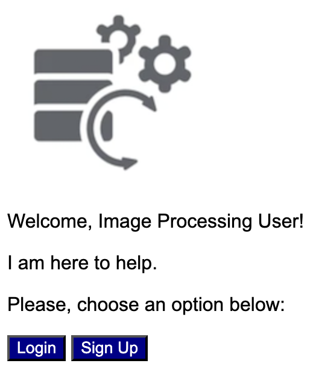
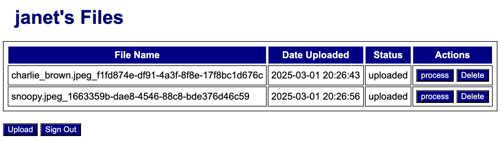

[](https://classroom.github.com/a/Xi4vcUbW)
# Overview 

The goal of this project is to deploy a web app written in Python Flask using Docker container technology and AWS's Elastic Container Service (ECS). The Flask app will allow authenticated users to manage their own files, which will be stored using AWS's S3 bucket object storage service. The deployment of this application will be automated using Terraform.

# Instructions 

## Part 1: S3 Bucket Creation and Access Configuration

In Part 1, you will create an S3 bucket and a resource policy that grants full access to it. You will also create a user with access keys and attach the policy to this user. Before you run the terraform for Part 1, make the appropriate changes in [variables.tf](part1/variables.tf).

## Part 2: Web App Development

In Part 2, you will make the necessary changes to your Python Flask web app and test it locally to verify that it fulfills all requirements. The app is located in [src](src). Begin by configuring a virtual environment and installing all dependencies using the following command:

```
pip3 install -r requirements.txt
```

One of the packages installed for this project is ```boto3```, which is a Python AWS SDK that will be used for the web app to communicate with the S3 bucket created in Part 1. 

As it stands, the app allows users to sign up, log in, and list/upload/process/delete files. However, the uploading and deletion of files are incomplete, as the communication with the S3 bucket has not been implemented. Your task is to complete the integration of the app with the S3 bucket.

Make sure you update the name of you bucket in [src/app/__init__.py](src/app/__init__.py) (variable ```S3_BUCKET```). 

When the app runs, it should display the initial screen: 



After creating a user and signing up, the app should display a list of files associated with the user. Try uploading one or two files; the list of files should be updated accordingly.



Once you have tested your application and are convinced that the communication with the S3 bucket is working as expected, proceed to the next part.

## Part 3: Web App Docker Deployment

The goal of this part is to package the application into a Docker image. Before proceeding with the packaging, ensure you update the application S3 access configuration to use the ECS policy instead. This should be done in [src/app/__init__.py](src/app/__init__.py). Also, make sure that the Docker image uses **linux/amd64** as the target platform to avoid potential problems in the future. For example, you can try building your image using: 

```
docker build --platform linux/amd64 -t prj01:v1 .
```

## Part 4: Docker Image Publishing 

In part 4, you are asked to upload the Docker image created in Part 3 into AWS ECR (Elastic Container Registry). Use the steps described in Activity 11 (Docker ECR). You can use the same registry named **dsml3850**. 

```
aws ecr get-login-password --region us-west-1 | docker login --username AWS --password-stdin 060795946302.dkr.ecr.us-west-1.amazonaws.com 

docker tag prj01:v1 060795946302.dkr.ecr.us-west-1.amazonaws.com/dsml3850:prj-01-v1

docker push 060795946302.dkr.ecr.us-west-1.amazonaws.com/dsml3850:prj-01-v1
```

## Part 5: ECS Deployment 

In the last part of this project, you will use the Docker image uploaded to ECR to deploy the application using AWS ECS. Use the steps described in Activity 12 (ECS). The only difference from Activity 12 is that you are required to create a Task Role so the application is able to access the S3 bucket. 

# Submission 

To get full credit in this assignment you need to push all of the files that you changed to GitHub Classroom. You should leave your app running and provide the public IP of your deployment below: 

```
Public IP: 54.151.66.52
```

# Grading

```
+0 Part 1: the code was given to you, so no points
+15 Part 2: the app is able to upload and delete files by successfully communicating with the bucket through Boto3
+5 Part 3: you remembered to update the application S3 access configuration to use the ECS policy instead
+10 Part 4: Dockerfile
+60 Part 5
    +5 variables.tf updated 
    +10 task execution role and policy 
    +10 task role and policy
    +10 security group
    +10 task definition 
    +5 ECS cluster
    +10 service
+5 public IP was given
+5 application works as expected
```